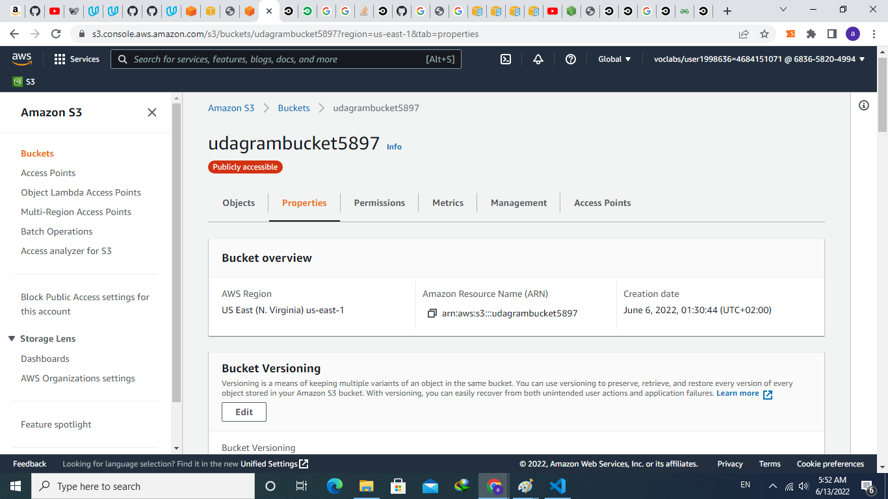
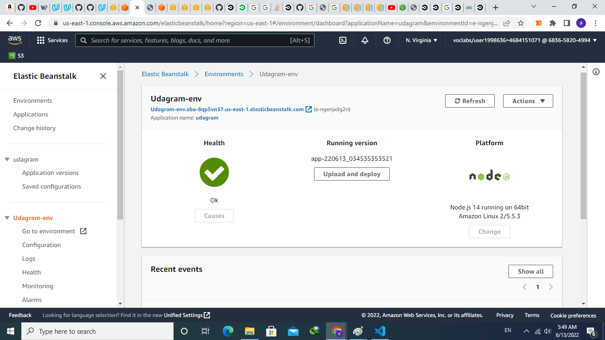
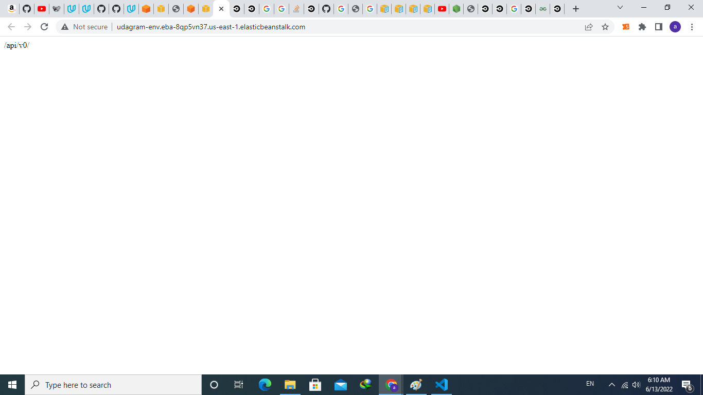

# Infrastructure description
In this project a developed full stack application is deployed to a cloud service provider so that it is available to customers. This application contains the main components of a 3-tier full stack application (UI, API, and Database).

## the following technologies of amazon web services(aws) are used:

## UI: the application's UI is hosted on an s3 bucket.

## API: the application's API server is hosted on elasticbeanstalk.

## Database: the application's database is hosted on an rds instance.

## git:
git is used for source control and github is used for the project's repository.
## circleci:
circleci is used for creating pipelines to perform CI/CD.
