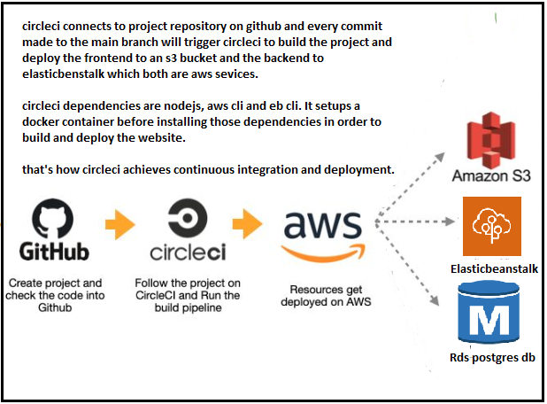
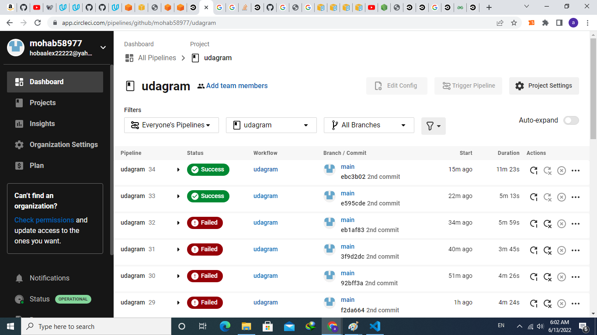
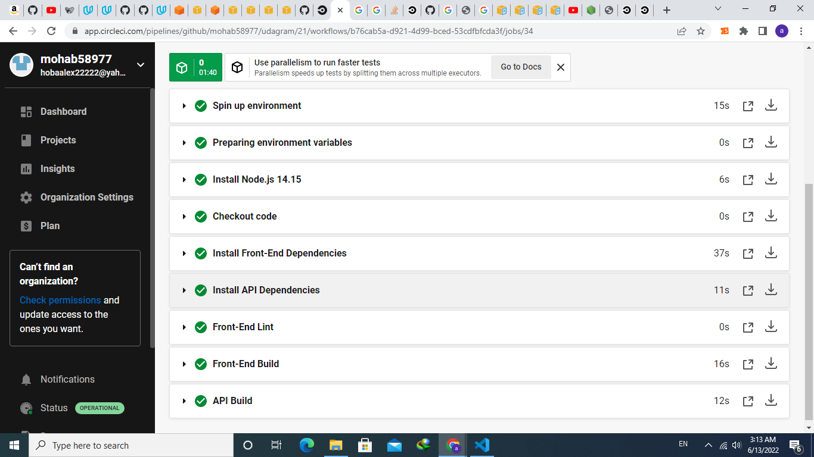
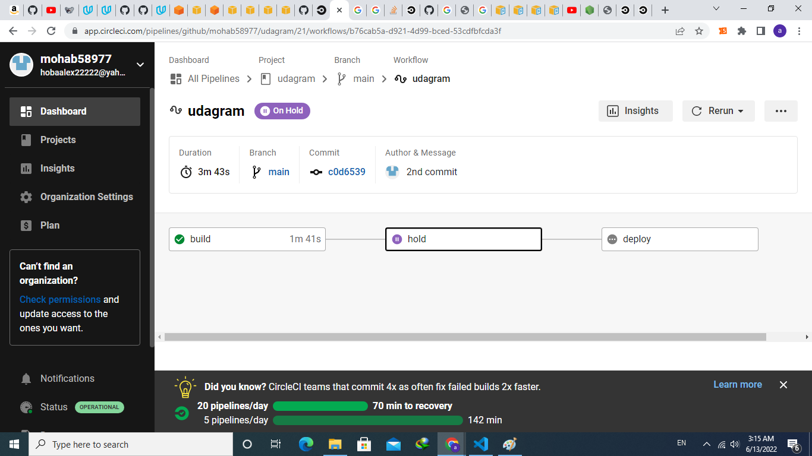
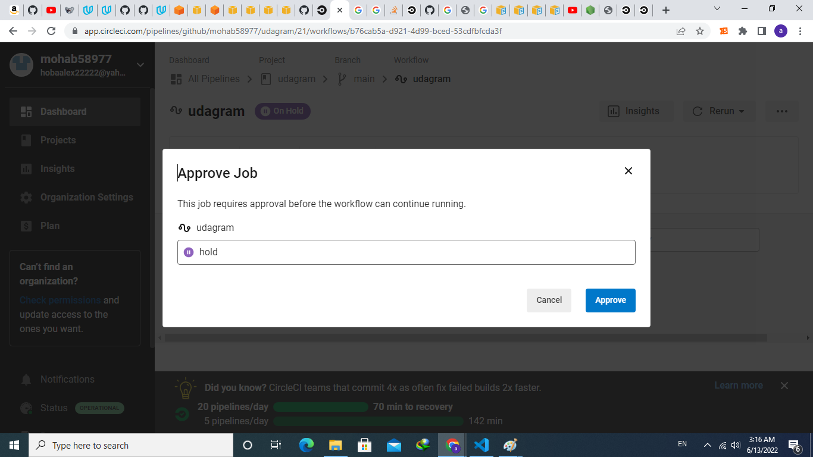
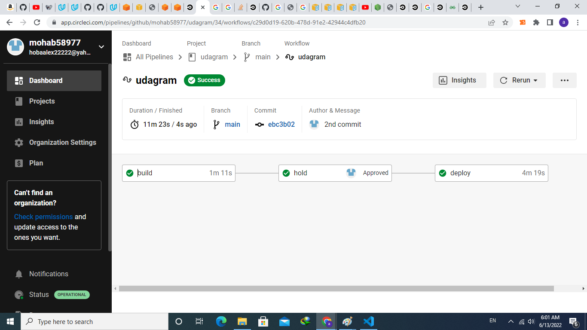
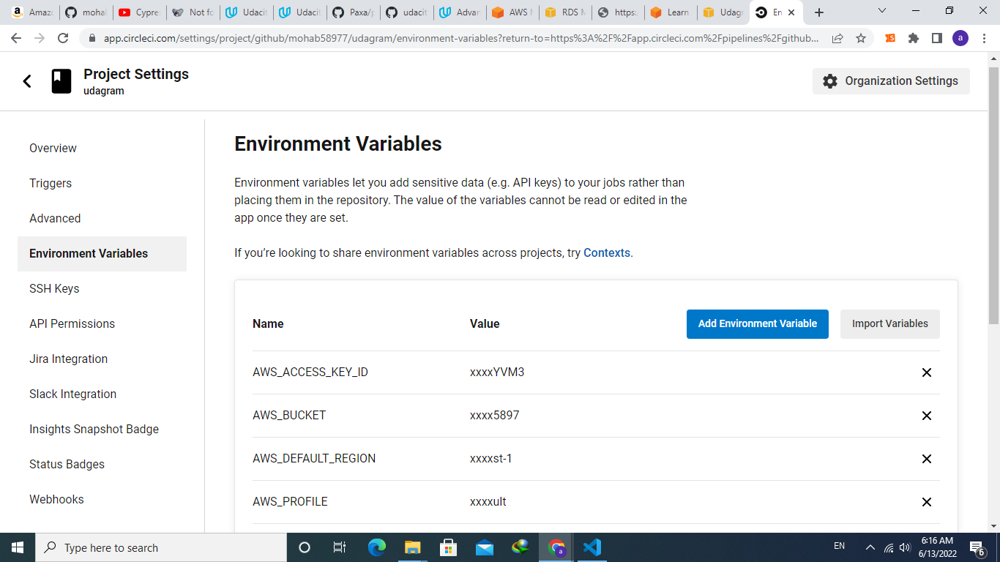

# Pipeline process
circleci takes the github repository and creates a pipeline to perform CI/CD.







## environment variables are set within circleci from the project settings page.


## circleci config file which describes the orchestration and workflow of the pipeline is found [here](../.circleci\config.yml)
  

 ## circleci config file is used to configure the pipeline , it build the frontend and backend, and it deploys the application to the cloud.

### frontend scripts to build and deploy
```
"build": "ng build" # build the frontend
"deploy": "npm install -f && npm run build # install and build then run the aws code for deployment
aws s3 cp --recursive --acl public-read ./www s3://udagrambucket5897/
aws s3 cp --acl public-read --cache-control="max-age=0, no-cache, no-store, must-revalidate" ./www/index.html s3://udagrambucket5897/
```
### backend scripts to build and deploy
```
"clean": "rm -rf www/ || true",
"setenv": "eb setenv POSTGRES_USERNAME=$POSTGRES_USERNAME  POSTGRES_PASSWORD=$POSTGRES_PASSWORD POSTGRES_HOST=$POSTGRES_HOST POSTGRES_DB=$POSTGRES_DB AWS_BUCKET=$AWS_BUCKET AWS_REGION=$AWS_REGION AWS_PROFILE=$AWS_PROFILE JWT_SECRET=$JWT_SECRET URL=$URL",
"build": "npm install . && npm run clean && tsc && cp -rf src/config www/config && cp -R .elasticbeanstalk www/.elasticbeanstalk && cp .npmrc www/.npmrc && cp package.json www/package.json && cd www && zip -r Archive.zip . && cd ..",
"deploy": "npm run build && printf 1 | eb init --region us-east-1 udagram && eb use udagram-env && npm run setenv && eb deploy",
    
```
### build: # builds the frontend
### deploy: # deploys the application to the cloud through building the application then compressing it and creating application version then deploying it to the elasticbeanstalk environment specified after setting the environment variables.